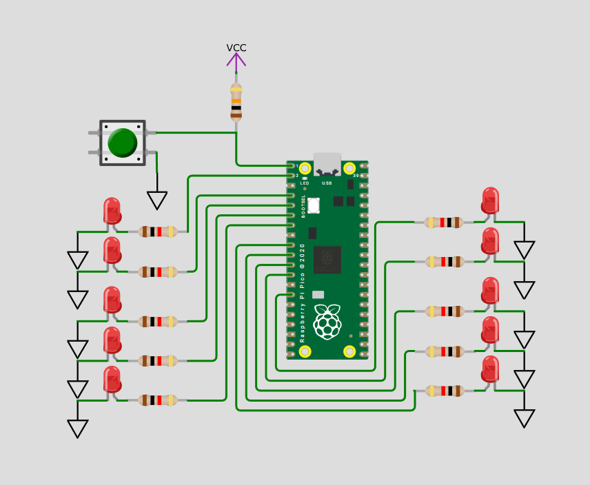

# Pico-LED-Chaser
I made a LED Chaser using a button, LEDs, and a raspberry pi pico. It starts when you press the button and if you press it again it stops.
# Project Image

# Project Gif

[Wokwi Link](https://wokwi.com/projects/464768442485338113)
